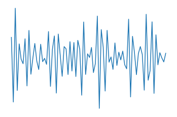
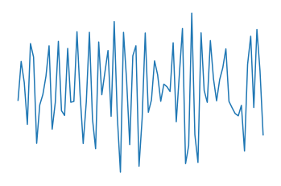

# End-to-End Auditory Object Recognition via Inception Nucleus
Keras (Tensorflow) implementation of the paper: 

## Notes:
- Proposing novel inception blocks for analyzing raw wave audio files. 
- We noticed the early layers are learning wavelet-like filters.
- Our analysis revealed that the network is learning semantically meaningful representations in the last layer.
- Using Global Average Pooling is very helpful in avoiding overfitting and reducing the number of parameters.


## How to re-run the experiments?

Dataset can be downloaded here: http://urbansounddataset.weebly.com/urbansound8k.html
After downloading the dataset you may extract it in "ds" folder.

```bash
git clone https://github.com/mkebrahimpour/e2e-Inception_Nucleus.git
cd e2e-Inception_Nucleus
sudo pip install -r requirements.txt
./run_all.sh # will run Inception Nucleus
```
## First layer filters:
<div align="center">
  <b></b><br>
  
  
  <br>
  
  
  <br>
</div>


<div align="center">
  <b>M5 model - best accuracy: 0.743, trainable params = 559,114</b><br>
  <br><br>
</div>

<div align="center">
  <b>M11 model - best accuracy: 0.752, trainable params = 1,786,442</b><br>
  <br><br>
</div>

<div align="center">
  <b>M18 model - best accuracy: 0.710, trainable params = 3,683,786</b><br>
  <br><br>
</div>

<div align="center">
  <b>M34 model - best accuracy: 0.725, trainable params = 3,984,154</b><br>
  <br><br>
</div>

